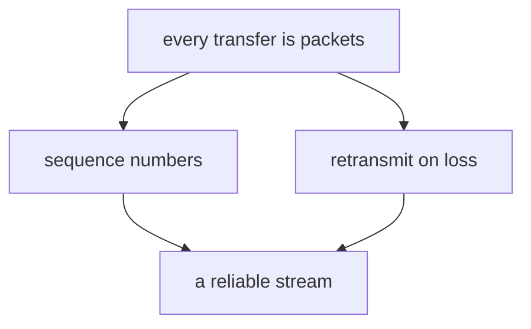
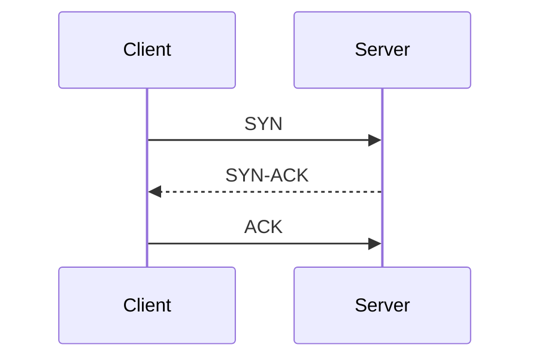

# Show me

Adapted for teaching from HumanLayer's `show-me` skill
(<https://github.com/humanlayer/skills>).

Pick the **smallest** view that makes the point, put it next to the sentence it
supports, and keep the prose around it short. A visual that restates the
paragraph beside it adds noise and one more thing to be wrong about. When in
doubt, do not draw it: a missing diagram costs less than a false one.

The lesson is mirrored to markdown by the `journal` extension and read in a
renderer, so Mermaid, LaTeX, and fenced code all render natively. Nothing here
needs an image pipeline.

## When a picture earns its place

This system builds a dependency graph in someone's head. A visual is worth it
exactly when it makes that structure — or a genuine geometry — visible:

- **Structure or relationship**: dependencies, parts and arrows, a pipeline, an
  exchange over time, a state machine, a hierarchy, containment.
- **Spatial or geometric**: coordinate geometry, a number line, vectors, the
  shape of a function, a physical arrangement.

Not worth it when a sentence or a single equation already carries it.

## The forms

**The dependency map.** The default, and the one that matches the pedagogy
directly. Unconditional truths at the roots, the goal as the sink, each node
hanging off what it was built from. Use it to present a plan and to show where a
new lesson attaches to what they already hold.



**The derivation chain**, when the point is that each step follows from the last
and you want the whole path visible at once.

```text
we need to compare two distributions
  → any comparison needs a single number
    → that number must be 0 only when they are identical
      → and must never be negative
        → KL divergence
```

**Pseudocode**, when the point is a procedure or a rule, and real syntax would
add noise the learner has to filter out.

```text
on(receive packet)
  if sequence number is next
    deliver it
  else
    hold it and wait
```

**A diff**, when the shape already exists and the point is what changes. This is
the sharpest tool for dislodging a wrong model — put their model and the correct
one in the same frame, so the difference is the only thing on screen.

```diff
 on(packet lost)
-  the connection drops
+  the sender waits for an ack that never comes
+  the sender resends
```

**A sequence**, when the point is who does what, in what order, over time.



**A tree**, when the point is containment or hierarchy.

```text
transport layer
├── TCP      # ordered, reliable, slower to start
└── UDP      # unordered, lossy, no handshake
```

**LaTeX**, whenever math is involved at all — inline as `$f(x)$`, display fenced
in `$$`. Never a plain-text approximation of notation.

**One focused HTML file**, for something genuinely too dense or too interactive
for the above: a geometric construction with a slider, a layout, a comparison
that needs real spacing. Write it, then open it:

```
Bash(open learning/viz/show-me-{slug}.html)
```

Keep it self-contained, readable in both light and dark, and honest — real
labels, real numbers, no decoration standing in for content.

## Briefing yourself

The failure mode is cramming. Every extra label makes the picture harder to read
*and* more likely to be wrong. Before drawing, prune: for each element, ask
whether the idea survives deleting it. If yes, delete it.

Five to seven elements is the ceiling for a diagram in a lesson. Past that you
are drawing the territory instead of a map, and the learner will study the
picture rather than the idea.

You will usually use one of these forms. Occasionally two. Almost never all of
them.
